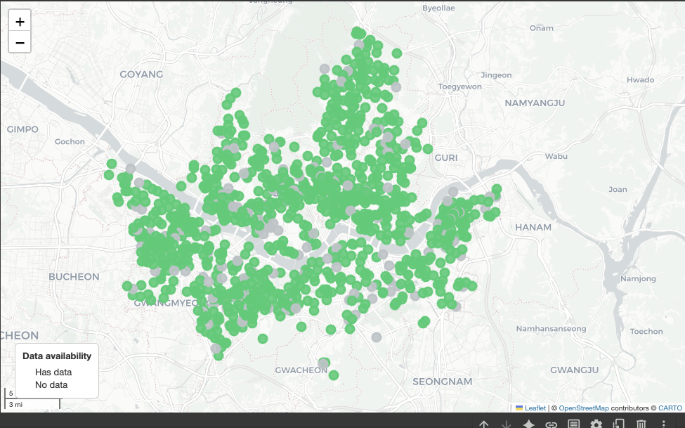
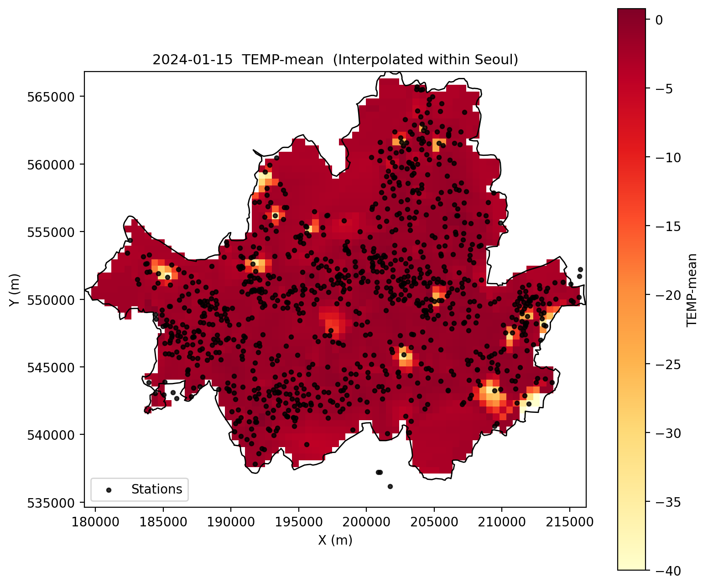

# Seoul S-DoT Data Tools | 서울 S-DoT 데이터 도구

This repository provides scripts and utilities for processing and analyzing environmental data from **Seoul’s Smart City Sensors (S-DoT)**.

이 저장소는 **서울 스마트도시 센서(S-DoT)** 환경 데이터를 처리·분석하기 위한 스크립트와 유틸리티를 제공합니다.

---

## 📊 Data Source | 데이터 출처
- Source URL: [Seoul Open Data Plaza | 서울 열린데이터 광장](https://data.seoul.go.kr/dataList/OA-15969/S/1/datasetView.do#)
- Data collected from **1,100+ S-DoT sensors** deployed in residential, commercial, industrial, road, and park areas.
- CSV files are **automatically downloaded** and **encoding is converted** to avoid any text corruption (no garbled characters).

---

## ✨ Features | 주요 기능
- **Automatic CSV download & encoding conversion** | CSV 자동 다운로드 및 인코딩 변환
- **Extract specific date ranges & indicators** | 특정 날짜 범위 및 지표 추출
- **Convert CSV to JSON structure** for further processing | CSV → JSON 변환
- **Visualization**: Dynamic map & static heatmap | 시각화: 동적 지도 및 정적 히트맵
- **Statistical summaries**: Min, max, average | 통계 요약: 최소값, 최대값, 평균값

---
## 🗺 Visualization Examples | 시각화 예시

**Dynamic Map | 동적 지도**  


**Static Heatmap | 정적 히트맵**  


## 🗂 Example JSON Structure | JSON 구조 예시
```json
{
  "station_id": "A123",
  "location": {"lat": 37.5665, "lon": 126.9780},
  "date_range": "2024-01-01 to 2024-01-31",
  "metrics": {
    "TEMP": [1.2, 3.4, 2.1, ...],
    "HUMI": [45, 50, 42, ...]
  }
}
